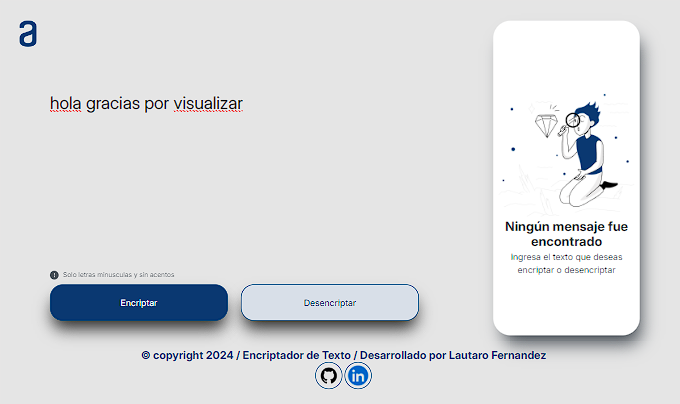
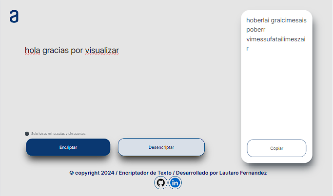
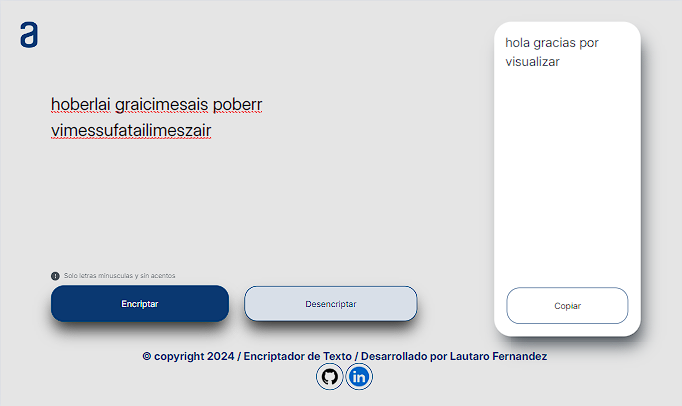

#DESAFIO ENCRIPTADOR DE TEXTO / ORACLE NEXT EDUCATION
Se llevo a cabo la planificacion y construccion de un encriptador de texto, proporcionado por Oracle en conjunto con Alura Latam

El proyecto contiene un textarea en la cual se introduce el texto. Debajo de este tiene un boton para encriptar el texto y otro para desencriptar. Tambien contiene otra seccion la cual proyecta en un textarea, el texto encriptado o desencriptado, debajo de esta misma aparecera un boton para copiar el contenido

Este es un proyecto responsive, significa que esta adaptado para movil y tablet

*Diseño del Encriptador:

*Encriptador Encriptando:

*Encriptador Desencriptando:

El diseño fue proporcionado por el figa de Alura Latam

El texto tiene condiciones especificas para lograr la encriptacion:
-No debe ser en mayusculas
-No sebe contener acentos
-No debe contener caracteres especiales

Las bases del escriptado del texto son:

-La letra "e" se convierte en "enter"

-La letra "i" se convierte en "imes"

-La letra "a" se convierte en "ai"

-La letra "o" se convierte en "ober"

-La letra "u" se convierte en "ufat"

#HERRAMIENTAS UTILIZADAS:

#REALIZADO POR:
Lautaro Fernandez Esposito
